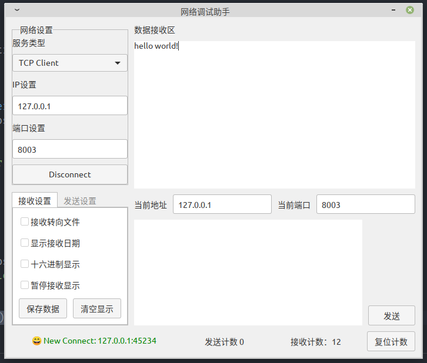

# Network Assistant

Linux Network Assistant

A network packet delivery/debug tool on the Linux desktop

- [x] TCP Client
- [x] TCP Server
- [x] UDP Client
- [x] UDP Server

## Get it
Download `netassistant` from releases.

### Build
```
go get
go build .
```


